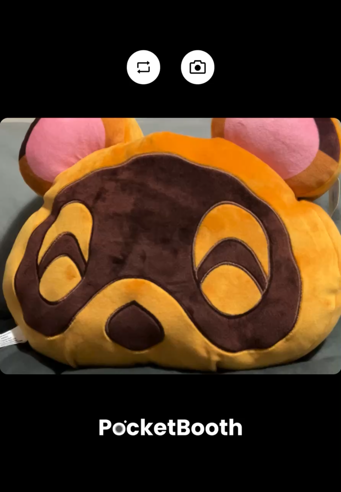
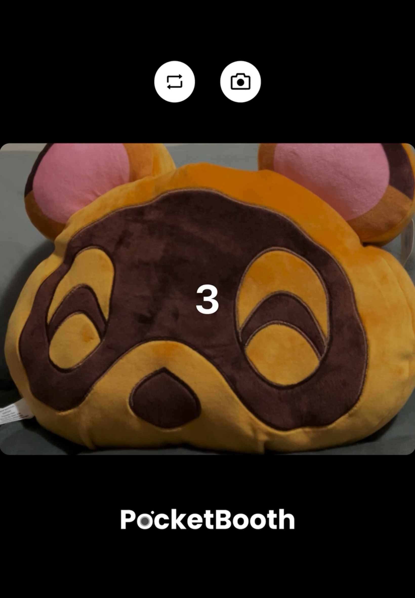

# 📸 Mobile Photobooth App - PocketBooth

A **React Native** mobile application that captures photos, compiles them into photo strips, and enables **instant sharing or printing** via **AirDrop** and connected printers.  
Designed for event use, the app dynamically adapts to various printer paper sizes, ensuring consistent quality and layout for every photo strip.

---

## 🖼️ Screenshots

### 📷 Camera Page

### 📸 Camera Page (During Countdown)

  
  
  

### 🎞️ Strip Page

---

## ✨ Features

- **Photo Capture & Strip Compilation**  
  Capture photos using the device camera and automatically compile them into classic photo strips.

- **Instant Sharing**  
  Share photo strips instantly using **AirDrop** or save them directly to local storage.

- **Direct Printing**  
  Supports connected printers for quick, seamless printing of finished photo strips.

- **Adaptive Layout System**  
  Dynamically adjusts photo strip dimensions to match printer paper size and orientation.

- **Performance Optimized**  
  Designed for reliable use during events, allowing smooth capture and printing sessions.

---

## 🧠 Technologies Used

- **React Native (TypeScript)**
- **Expo** (for camera and image handling)
- **React Navigation**
- **Native Modules for AirDrop and Print Integration**
- **Styled Components** (for UI consistency)
